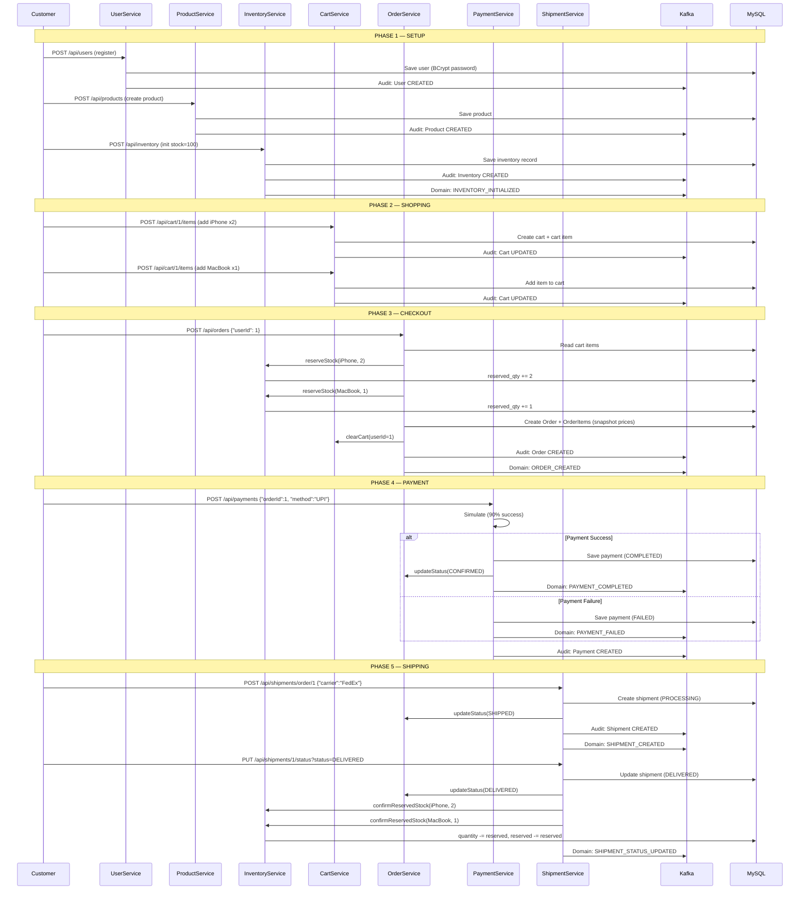

# E-Commerce Backend API — Complete Project Walkthrough

## Table of Contents
1. [Project Overview](#1-project-overview)
2. [How to Run](#2-how-to-run)
3. [Architecture Overview](#3-architecture-overview)
4. [Folder Structure Explained](#4-folder-structure-explained)
5. [The Complete Order Lifecycle](#5-the-complete-order-lifecycle)
6. [Module-by-Module Deep Dive](#6-module-by-module-deep-dive)
7. [Kafka Event Architecture](#7-kafka-event-architecture)
8. [Redis Caching Strategy](#8-redis-caching-strategy)
9. [History/Audit System](#9-historyaudit-system)
10. [Error Handling](#10-error-handling)
11. [API Reference](#11-api-reference)
12. [Design Patterns Summary](#12-design-patterns-summary)

---

## 1. Project Overview

This is a **production-grade E-Commerce Backend API** built with Spring Boot. It started as a simple Product CRUD demo and was extended into a full e-commerce system with 7 interconnected modules.

### Tech Stack
| Technology | Purpose |
|---|---|
| **Spring Boot 3.5** | Application framework |
| **Spring Data JPA** | Database access (ORM) |
| **MySQL** | Relational database |
| **Redis** | Distributed cache |
| **Caffeine** | In-memory local cache |
| **Custom LRU Cache** | LinkedHashMap-based cache |
| **Apache Kafka** | Event streaming / messaging |
| **Lombok** | Boilerplate code reduction |
| **SpringDoc OpenAPI** | Swagger UI documentation |
| **BCrypt** | Password hashing |

### What This Project Does
A customer can:
1. **Register** an account
2. **Browse** products
3. **Add products** to a shopping cart
4. **Place an order** (checkout)
5. **Pay** for the order (simulated)
6. **Track** the shipment

Behind the scenes:
- Every action publishes **Kafka events** for audit and analytics
- **Redis caches** frequently accessed data (products, inventory)
- **Inventory** is tracked with reservation logic to prevent overselling
- All CREATE/UPDATE/DELETE actions are logged in a **history table**

---

## 2. How to Run

> [!IMPORTANT]
> You must run commands from inside the `demo/` directory where `pom.xml` lives.

```bash
# Navigate to the correct directory
cd ~/Downloads/demo\ \(1\)/demo

# Run the application (uses Maven wrapper — no Maven install needed)
./mvnw spring-boot:run

# Or if you have Maven installed globally:
mvn spring-boot:run
```

**Prerequisites:**
- Java 17+
- MySQL running on localhost:3306 with a database called `demo`
- Redis and Kafka are auto-started via embedded servers (no manual setup)

**Access Points:**
- API: `http://localhost:8080`
- Swagger UI: `http://localhost:8080/swagger-ui.html`

---

## 3. Architecture Overview

### Layered Architecture (per module)

```
┌─────────────────────────────────────────────────────────┐
│  CLIENT (Browser / Postman / Swagger UI)                │
└───────────────────────┬─────────────────────────────────┘
                        │ HTTP Request (JSON)
                        ▼
┌─────────────────────────────────────────────────────────┐
│  CONTROLLER LAYER  (@RestController)                    │
│  - Receives HTTP requests                               │
│  - Validates input (@Valid)                              │
│  - Delegates to Service                                 │
│  - Returns HTTP response with proper status code        │
│  - NO business logic here                               │
└───────────────────────┬─────────────────────────────────┘
                        │ Method call (DTO)
                        ▼
┌─────────────────────────────────────────────────────────┐
│  SERVICE LAYER  (@Service)                              │
│  - Contains ALL business logic                          │
│  - Coordinates between multiple repositories            │
│  - Manages transactions (@Transactional)                │
│  - Publishes Kafka events                               │
│  - Manages cache (read/write/evict)                     │
│  - Maps DTOs ↔ Entities                                 │
└──────┬──────────────────┬───────────────┬───────────────┘
       │                  │               │
       ▼                  ▼               ▼
┌──────────────┐  ┌───────────────┐  ┌────────────────┐
│  REPOSITORY  │  │  KAFKA        │  │  REDIS CACHE   │
│  (JPA)       │  │  (Producer)   │  │  (Template)    │
│              │  │               │  │                │
│  MySQL DB    │  │  Broker       │  │  Redis Server  │
└──────────────┘  └───────────────┘  └────────────────┘
```

### How a Request Flows (Example: Create Product)

```
1. POST /api/products  {"name":"iPhone","price":999}
       │
2. ProductController.createProduct(@Valid ProductRequest)
       │
3. ProductService.createProduct(request)
       │
       ├── 3a. Build Product entity from DTO
       ├── 3b. productRepository.save(product)     → MySQL INSERT
       ├── 3c. productCacheService.cacheProduct()   → Redis SET
       ├── 3d. productCacheService.evictCollections()→ Clear list caches
       ├── 3e. historyProducer.sendEvent()          → Kafka "history-events"
       │
4. Return Product entity → JSON response (HTTP 201)
```

---

## 4. Folder Structure Explained

```
src/main/java/com/example/demo/
│
├── DemoApplication.java          ← Entry point. Starts embedded Kafka+Redis, then Spring.
│
├── cache/                        ← CACHING LAYER
│   ├── ProductCacheService.java  ← Redis + LRU + Caffeine for products
│   ├── ProductLruCache.java      ← Custom LinkedHashMap LRU cache
│   └── InventoryCacheService.java← Redis cache for inventory stock
│
├── config/                       ← CONFIGURATION
│   ├── CacheConfig.java          ← Caffeine cache bean
│   ├── KafkaConfig.java          ← Kafka for HistoryEvent (typed)
│   ├── DomainKafkaConfig.java    ← Kafka for domain events (String)
│   ├── RedisConfig.java          ← RedisTemplate with JSON serializer
│   ├── SwaggerConfig.java        ← OpenAPI documentation config
│   └── LocalInfraBootstrap.java  ← Embedded Kafka + Redis startup
│
├── controller/                   ← REST API ENDPOINTS (thin layer)
│   ├── ProductController.java    ← /api/products
│   ├── UserController.java       ← /api/users
│   ├── InventoryController.java  ← /api/inventory
│   ├── CartController.java       ← /api/cart
│   ├── OrderController.java      ← /api/orders
│   ├── PaymentController.java    ← /api/payments
│   ├── ShipmentController.java   ← /api/shipments
│   └── HistoryController.java    ← /api/history
│
├── dto/                          ← DATA TRANSFER OBJECTS (API contracts)
│   ├── ProductRequest.java       ← Input for product creation
│   ├── UserRequest/Response.java ← User API contract (password excluded from response)
│   ├── InventoryRequest/Response ← Stock management payloads
│   ├── CartItemRequest.java      ← Add-to-cart payload
│   ├── CartResponse.java         ← Full cart view with nested items
│   ├── OrderRequest/Response.java← Order creation and view
│   ├── PaymentRequest/Response   ← Payment processing
│   └── ShipmentRequest/Response  ← Shipment tracking
│
├── entity/                       ← JPA ENTITIES (database tables)
│   ├── Product.java              ← products table
│   ├── User.java                 ← users table
│   ├── Inventory.java            ← inventory table (1:1 with Product)
│   ├── Cart.java                 ← carts table (1:1 with User)
│   ├── CartItem.java             ← cart_items table (M:1 with Cart+Product)
│   ├── Order.java                ← orders table
│   ├── OrderItem.java            ← order_items table (price snapshots)
│   ├── Payment.java              ← payments table (1:1 with Order)
│   ├── Shipment.java             ← shipments table (1:1 with Order)
│   └── History.java              ← history table (audit log)
│
├── enums/                        ← TYPE-SAFE CONSTANTS
│   ├── ActionType.java           ← CREATE, UPDATE, DELETE
│   ├── ProductStatus.java        ← ACTIVE, INACTIVE, OUT_OF_STOCK
│   ├── UserRole.java             ← ADMIN, CUSTOMER
│   ├── OrderStatus.java          ← PENDING → CONFIRMED → SHIPPED → DELIVERED
│   ├── PaymentStatus.java        ← PENDING, COMPLETED, FAILED, REFUNDED
│   ├── PaymentMethod.java        ← CREDIT_CARD, DEBIT_CARD, UPI, NET_BANKING
│   └── ShipmentStatus.java       ← PROCESSING → SHIPPED → IN_TRANSIT → DELIVERED
│
├── exception/                    ← ERROR HANDLING
│   ├── GlobalExceptionHandler.java    ← @ControllerAdvice — catches ALL exceptions
│   ├── ResourceNotFoundException.java ← 404 errors
│   └── InsufficientStockException.java← 409 conflict (not enough stock)
│
├── kafka/                        ← KAFKA PRODUCERS + CONSUMERS
│   ├── HistoryEvent.java         ← Audit event payload
│   ├── HistoryProducer.java      ← Sends to "history-events" topic
│   ├── HistoryConsumer.java      ← Listens to "history-events", saves to DB
│   ├── DomainEventProducer.java  ← Sends JSON to domain topics
│   └── DomainEventConsumer.java  ← Listens to all domain topics, logs them
│
├── repository/                   ← DATA ACCESS (Spring Data JPA interfaces)
│   ├── ProductRepository.java
│   ├── UserRepository.java
│   ├── InventoryRepository.java
│   ├── CartRepository.java
│   ├── CartItemRepository.java
│   ├── OrderRepository.java
│   ├── OrderItemRepository.java
│   ├── PaymentRepository.java
│   ├── ShipmentRepository.java
│   └── HistoryRepository.java
│
└── service/                      ← BUSINESS LOGIC
    ├── ProductService.java       ← Product CRUD + cache + audit
    ├── UserService.java          ← User CRUD + BCrypt password hashing
    ├── InventoryService.java     ← Stock management + reservation system
    ├── CartService.java          ← Shopping cart operations
    ├── OrderService.java         ← Order creation (orchestrates Cart+Inventory)
    ├── PaymentService.java       ← Simulated payment processing (90% success)
    ├── ShipmentService.java      ← Delivery tracking + status management
    └── HistoryService.java       ← Audit log retrieval
```

---

## 5. The Complete Order Lifecycle

This is the **most important workflow** — it shows how all 7 modules work together.



### State Machines

**Order Status Flow:**
```
PENDING ──→ CONFIRMED ──→ SHIPPED ──→ DELIVERED
   │             │
   └─→ CANCELLED ←┘
```

**Payment Status Flow:**
```
PENDING ──→ COMPLETED
   │
   └──→ FAILED
```

**Shipment Status Flow:**
```
PROCESSING ──→ SHIPPED ──→ IN_TRANSIT ──→ DELIVERED
                                │
                                └──→ RETURNED
```

---

## 6. Module-by-Module Deep Dive

### 6A. Product Module (EXISTING — preserved)

**What it does:** CRUD operations for the product catalog.

**Files:** `Product.java` → `ProductRepository.java` → `ProductService.java` → `ProductController.java`

**Caching:** 3-layer cache strategy:
- **Redis** — individual product by ID (`product:{id}`)
- **LRU Cache** — all products list (`products:all`)
- **Caffeine** — search results (`products:search:{term}`)

**Flow — Get Product by ID:**
```
1. Check Redis cache → HIT? Return cached product
2. Cache MISS → Query MySQL
3. Store in Redis for future requests
4. Return product
```

---

### 6B. User Module

**What it does:** User registration and management with password hashing.

**Key Decision — BCrypt:**
```java
// Plain text: "MyPassword123"
// After BCrypt: "$2a$10$N9qo8uLOickgx2ZMRZoMyeIjZAgcfl7p92ldGxad68LJZdL17lhWy"
```
BCrypt is intentionally slow (prevents brute force) and includes a random salt per hash (prevents rainbow tables).

**Why UserResponse excludes password:**
```
UserRequest (input):  { email, password, fullName, phone, role }
UserResponse (output): { id, email, fullName, phone, role, createdAt }  ← NO password!
```

---

### 6C. Inventory Module

**What it does:** Tracks stock quantities with a reservation system.

**Key Concept — Stock Reservation:**
```
Total Quantity:     100 (physical stock in warehouse)
Reserved Quantity:   20 (reserved by pending orders)
Available Quantity:  80 (can still be sold)

When order is PLACED:     reserved += ordered_qty
When order is CANCELLED:  reserved -= ordered_qty
When order is DELIVERED:  quantity -= ordered_qty, reserved -= ordered_qty
```

**Why separate from Product?** Inventory changes on every order (high write frequency). Product metadata rarely changes. Separating them avoids database lock contention.

---

### 6D. Cart Module

**What it does:** Persistent shopping cart (database-backed, not session-based).

**Key Behaviors:**
- Cart is **lazily created** on first add-to-cart
- Adding the same product **adds quantities** (not duplicates)
- Cart **survives logout** (stored in DB, not browser session)

---

### 6E. Order Module

**What it does:** Converts a cart into a purchasable order.

**Why OrderItem stores `unitPrice`?**
Product prices can change after an order is placed. `OrderItem.unitPrice` is a **snapshot** — the price at checkout time. This ensures the customer is charged correctly even if the product price changes later.

**Order Number Format:** `ORD-20260615-A3F2C1` (date + random hex)

---

### 6F. Payment Module

**What it does:** Simulates payment processing (90% success rate).

**Why simulate?** Real payment gateways (Stripe, Razorpay) require API keys, merchant accounts, and PCI compliance. Simulation lets you test the full flow.

**Transaction ID Format:** `TXN-20260615-A3F2C1D8`

---

### 6G. Shipment Module

**What it does:** Tracks package delivery from warehouse to customer.

**Key Behavior — On DELIVERED:**
1. Sets `actualDelivery` timestamp
2. Updates order status → DELIVERED
3. Calls `confirmReservedStock()` — deducts reserved stock from inventory permanently

**Tracking Number Format:** `SHIP-20260615-A3F2C1D8`

---

## 7. Kafka Event Architecture

### Two Separate Pipelines

```
PIPELINE 1: AUDIT (existing)
┌─────────────┐    "history-events"    ┌─────────────────┐    ┌─────────┐
│ HistoryProd. │ ──────────────────→  │ HistoryConsumer  │ →  │ MySQL   │
│ (any service)│    HistoryEvent       │ (saves to DB)    │    │ history │
└─────────────┘    {type,id,action}    └─────────────────┘    └─────────┘

PIPELINE 2: DOMAIN EVENTS (new)
┌──────────────┐   "order-events"      ┌──────────────────┐
│ DomainEvent  │   "inventory-events"  │ DomainEvent      │
│ Producer     │ ──────────────────→  │ Consumer         │ → Logs (future: notifications)
│ (any service)│   "shipment-events"   │ (logs events)    │
└──────────────┘   "payment-events"    └──────────────────┘
                   JSON strings
```

**Why two pipelines?**
- **Audit pipeline** uses typed `HistoryEvent` objects — compact, just for record-keeping
- **Domain pipeline** uses JSON strings — richer data, for downstream consumers (notifications, analytics, dashboards)

### Topics

| Topic | Events | Example Payload |
|---|---|---|
| `history-events` | All CRUD actions | `{objectType:"Order", objectId:1, action:"CREATE"}` |
| `order-events` | ORDER_CREATED, ORDER_CANCELLED | `{type:"ORDER_CREATED", orderId:1, totalAmount:999}` |
| `inventory-events` | STOCK_ADDED, STOCK_DEDUCTED | `{type:"STOCK_ADDED", productId:1, quantity:100}` |
| `payment-events` | PAYMENT_COMPLETED, PAYMENT_FAILED | `{type:"PAYMENT_COMPLETED", transactionId:"TXN-..."}` |
| `shipment-events` | SHIPMENT_CREATED, STATUS_UPDATED | `{type:"SHIPMENT_CREATED", trackingNumber:"SHIP-..."}` |

---

## 8. Redis Caching Strategy

### Cache-Aside Pattern (used everywhere)

```
READ:
  1. Check Redis → HIT? Return cached value
  2. MISS → Query MySQL
  3. Store result in Redis
  4. Return result

WRITE:
  1. Write to MySQL
  2. Evict/refresh Redis cache
```

### Fail-Open Design
All Redis calls are wrapped in `try/catch`. If Redis is down, the app continues working (just slower — every request hits MySQL).

```java
public Optional<Product> getProduct(Long id) {
    try {
        Object value = redisTemplate.opsForValue().get("product:" + id);
        if (value instanceof Product p) return Optional.of(p);
    } catch (Exception ex) {
        // Redis down? No problem — fall back to DB
    }
    return Optional.empty();
}
```

---

## 9. History/Audit System

Every service publishes audit events through the **same pattern**:

```java
private void publishHistory(Order order, ActionType actionType) {
    historyProducer.sendEvent(new HistoryEvent(
        "Order",           // What type of object
        order.getId(),     // Which specific object
        actionType.name()  // What happened (CREATE/UPDATE/DELETE)
    ));
}
```

The `HistoryConsumer` listens on Kafka and saves each event to the `history` table:

| id | object_type | object_id | action | created_at |
|---|---|---|---|---|
| 1 | Product | 1 | CREATE | 2026-06-15 10:00:00 |
| 2 | User | 1 | CREATE | 2026-06-15 10:01:00 |
| 3 | Inventory | 1 | CREATE | 2026-06-15 10:02:00 |
| 4 | Cart | 1 | UPDATE | 2026-06-15 10:03:00 |
| 5 | Order | 1 | CREATE | 2026-06-15 10:04:00 |

View all audit logs: `GET /api/history`

---

## 10. Error Handling

`GlobalExceptionHandler` catches ALL exceptions and returns structured JSON:

| Exception | HTTP Status | When |
|---|---|---|
| `ResourceNotFoundException` | 404 | Entity not found in DB |
| `InsufficientStockException` | 409 | Not enough stock |
| `MethodArgumentNotValidException` | 400 | @Valid fails |
| `ResponseStatusException` | varies | Business rule violations |
| `Exception` (catch-all) | 500 | Unexpected errors |

**Example error response:**
```json
{
  "timestamp": "2026-06-15T10:00:00",
  "status": 404,
  "error": "Not Found",
  "message": "User not found with id: '999'"
}
```

---

## 11. API Reference

### Product APIs
| Method | Endpoint | Description |
|---|---|---|
| POST | `/api/products` | Create product |
| GET | `/api/products` | List all products |
| GET | `/api/products/{id}` | Get product by ID |
| GET | `/api/products/search?name=` | Search products |
| PUT | `/api/products/{id}` | Update product |
| DELETE | `/api/products/{id}` | Delete product |

### User APIs
| Method | Endpoint | Description |
|---|---|---|
| POST | `/api/users` | Register user |
| GET | `/api/users` | List all users |
| GET | `/api/users/{id}` | Get user by ID |
| PUT | `/api/users/{id}` | Update user |
| DELETE | `/api/users/{id}` | Delete user |

### Inventory APIs
| Method | Endpoint | Description |
|---|---|---|
| POST | `/api/inventory` | Initialize stock |
| GET | `/api/inventory/product/{id}` | Get stock |
| PUT | `/api/inventory/product/{id}/add?quantity=N` | Add stock |
| PUT | `/api/inventory/product/{id}/deduct?quantity=N` | Deduct stock |

### Cart APIs
| Method | Endpoint | Description |
|---|---|---|
| GET | `/api/cart/{userId}` | View cart |
| POST | `/api/cart/{userId}/items` | Add item |
| PUT | `/api/cart/{userId}/items/{productId}?quantity=N` | Update qty |
| DELETE | `/api/cart/{userId}/items/{productId}` | Remove item |
| DELETE | `/api/cart/{userId}` | Clear cart |

### Order APIs
| Method | Endpoint | Description |
|---|---|---|
| POST | `/api/orders` | Create from cart |
| GET | `/api/orders/{id}` | Get order |
| GET | `/api/orders/user/{userId}` | User's orders |
| PUT | `/api/orders/{id}/cancel` | Cancel order |

### Payment APIs
| Method | Endpoint | Description |
|---|---|---|
| POST | `/api/payments` | Process payment |
| GET | `/api/payments/order/{orderId}` | Payment status |

### Shipment APIs
| Method | Endpoint | Description |
|---|---|---|
| POST | `/api/shipments/order/{orderId}` | Create shipment |
| GET | `/api/shipments/order/{orderId}` | Get by order |
| PUT | `/api/shipments/{id}/status?status=X` | Update status |
| GET | `/api/shipments/track/{trackingNumber}` | Track package |

### History API
| Method | Endpoint | Description |
|---|---|---|
| GET | `/api/history` | View all audit logs |

---

## 12. Design Patterns Summary

| Pattern | Where Used | Why |
|---|---|---|
| **Repository** | All `*Repository` interfaces | Abstracts data access from business logic |
| **Service Layer** | All `*Service` classes | Encapsulates business logic, keeps controllers thin |
| **DTO** | All `*Request/*Response` classes | Decouples API contract from entity; security (hide password) |
| **Builder** | All entities via `@Builder` | Clean object construction |
| **Observer** | Kafka producers + consumers | Decoupled event-driven communication |
| **Cache-Aside** | `ProductCacheService`, `InventoryCacheService` | Check cache → miss → DB → populate cache |
| **Factory** | Order/Transaction/Tracking number generation | Encapsulates ID creation logic |
| **State Machine** | OrderStatus, ShipmentStatus, PaymentStatus | Controls valid state transitions |
| **Singleton** | All Spring beans (`@Service`, `@Component`) | One instance per class, managed by Spring IoC |
| **Template Method** | `KafkaTemplate`, `RedisTemplate` | Spring's abstraction over infrastructure |
| **Aggregate Root** | `Cart` (owns CartItems), `Order` (owns OrderItems) | Entity that controls its children's lifecycle |
| **Lazy Initialization** | Cart creation on first add-to-cart | Don't create until needed |
